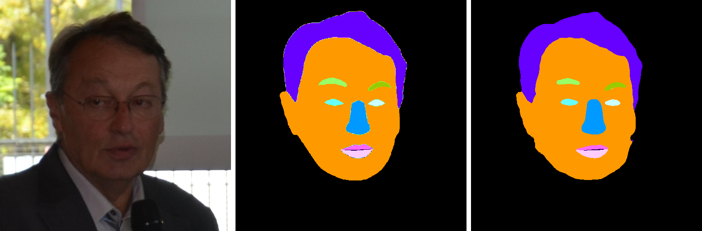

# UNET
 Human Face Segmentation using the UNET architecture in TensorFlow 2.0 framework.
 
 ## YouTube Tutorial
 [Human Face Segmentation using UNET in TensorFlow](https://youtu.be/yUOlLd-8jng) 

## Results
The images below contains:
1. Input image
2. Ground truth 
3. Predicted mask

|  |
| :--: |
|  |
|  |

## Architecture
The block diagram of the UNET architecture taken from the original paper.

|  |
| :--: |
| *U-Net Architecture* |
